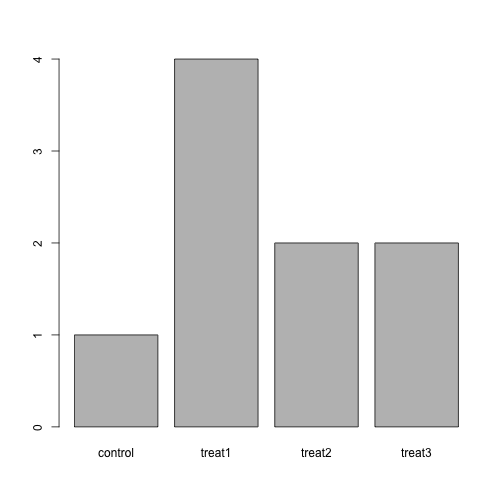
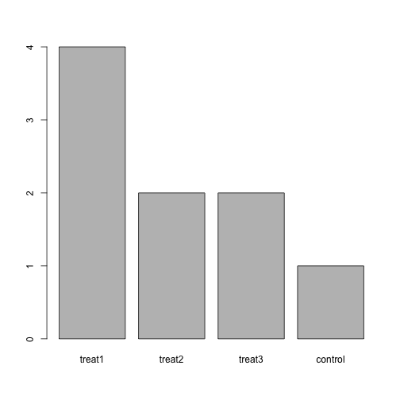

------------

> ## Learning Objectives
>
> * load external data (CSV files) in memory using the survey table
>  (`Ecoli_metadata.csv`) as an example
> * explore the structure and the content of the data in R
> * understand what are factors and how to manipulate them

------------

# Looking at Metadata


We are studying a population of Escherichia coli (designated Ara-3), which were propagated for more than 40,000 generations in a glucose-limited minimal medium. This medium was supplemented with citrate which E. coli cannot metabolize in the aerobic conditions of the experiment. Sequencing of the populations at regular time points reveals that spontaneous citrate-using mutants (Cit+) appeared at around 31,000 generations. This metadata describes information on the Ara-3 clones and the columns represent:

| Column           | Description                                |
|------------------|--------------------------------------------|
| sample           | clone name					|
| generation       | generation when sample frozen		|
| clade            | based on parsimony-based tree		|
| strain           | ancestral strain				|
| cit              | citrate-using mutant status		|
| run              | Sequence read archive sample ID		|
| genome_size      | size in Mbp (made up data for this lesson) |


The metadata file required for this lesson can be downlaoded by clicking on this [link](./data/Ecoli_metadata.csv)

- First, make sure you are in the correct working directory by typing `getwd()`.
- Second, create a new directory within this working directory called `data`
- Third, move the downloaded file into this directory

You are now ready to load the data. We are going to use the R function  `read.csv()` to load the data file into memory (as a `data.frame`):


```r
metadata <- read.csv('data/Ecoli_metadata.csv')
```

This statement doesn't produce any output because assignment doesn't display
anything. If we want to check that our data has been loaded, we can print the
variable's value: `metadata`

Alternatively, wrapping an assignment in parentheses will perform the assignment
and display it at the same time.


```r
(metadata <- read.csv('data/Ecoli_metadata.csv'))
```

```
##      sample generation   clade strain     cit       run genome_size
## 1    REL606          0    <NA> REL606 unknown                  4.62
## 2  REL1166A       2000 unknown REL606 unknown SRR098028        4.63
## 3    ZDB409       5000 unknown REL606 unknown SRR098281        4.60
## 4    ZDB429      10000      UC REL606 unknown SRR098282        4.59
## 5    ZDB446      15000      UC REL606 unknown SRR098283        4.66
## 6    ZDB458      20000 (C1,C2) REL606 unknown SRR098284        4.63
## 7   ZDB464*      20000 (C1,C2) REL606 unknown SRR098285        4.62
## 8    ZDB467      20000 (C1,C2) REL606 unknown SRR098286        4.61
## 9    ZDB477      25000      C1 REL606 unknown SRR098287        4.65
## 10   ZDB483      25000      C3 REL606 unknown SRR098288        4.59
## 11    ZDB16      30000      C1 REL606 unknown SRR098031        4.61
## 12   ZDB357      30000      C2 REL606 unknown SRR098280        4.62
## 13  ZDB199*      31500      C1 REL606   minus SRR098044        4.62
## 14   ZDB200      31500      C2 REL606   minus SRR098279        4.63
## 15   ZDB564      31500    Cit+ REL606    plus SRR098289        4.74
## 16   ZDB30*      32000      C3 REL606   minus SRR098032        4.61
## 17   ZDB172      32000    Cit+ REL606    plus SRR098042        4.77
## 18   ZDB158      32500      C2 REL606   minus SRR098041        4.63
## 19   ZDB143      32500    Cit+ REL606    plus SRR098040        4.79
## 20   CZB199      33000      C1 REL606   minus SRR098027        4.59
## 21   CZB152      33000    Cit+ REL606    plus SRR097977        4.80
## 22   CZB154      33000    Cit+ REL606    plus SRR098026        4.76
## 23    ZDB83      34000    Cit+ REL606   minus SRR098034        4.60
## 24    ZDB87      34000      C2 REL606    plus SRR098035        4.75
## 25    ZDB96      36000    Cit+ REL606    plus SRR098036        4.74
## 26    ZDB99      36000      C1 REL606   minus SRR098037        4.61
## 27   ZDB107      38000    Cit+ REL606    plus SRR098038        4.79
## 28   ZDB111      38000      C2 REL606   minus SRR098039        4.62
## 29 REL10979      40000    Cit+ REL606    plus SRR098029        4.78
## 30 REL10988      40000      C2 REL606   minus SRR098030        4.62
```

Wow... that was a lot of output. At least it means the data loaded properly. Let's check the top (the first 6 lines) of this `data.frame` using the function `head()`:


```r
head(metadata)
```

```
##     sample generation   clade strain     cit       run genome_size
## 1   REL606          0    <NA> REL606 unknown                  4.62
## 2 REL1166A       2000 unknown REL606 unknown SRR098028        4.63
## 3   ZDB409       5000 unknown REL606 unknown SRR098281        4.60
## 4   ZDB429      10000      UC REL606 unknown SRR098282        4.59
## 5   ZDB446      15000      UC REL606 unknown SRR098283        4.66
## 6   ZDB458      20000 (C1,C2) REL606 unknown SRR098284        4.63
```

We've just done two very useful things.
1. We've read our data in to R, so now we can work with it in R
2. We've created a data frame (with the read.csv command) the 
standard way R works with data. 

# What are data frames?

`data.frame` is the _de facto_ data structure for most tabular data and what we
use for statistics and plotting.

A `data.frame` is a collection of vectors of identical lengths. Each vector
represents a column, and each vector can be of a different data type (e.g.,
characters, integers, factors). The `str()` function is useful to inspect the
data types of the columns.

A `data.frame` can be created by the functions `read.csv()` or `read.table()`, in
other words, when importing spreadsheets from your hard drive (or the web).

By default, `data.frame` converts (= coerces) columns that contain characters
(i.e., text) into the `factor` data type. Depending on what you want to do with
the data, you may want to keep these columns as `character`. To do so,
`read.csv()` and `read.table()` have an argument called `stringsAsFactors` which
can be set to `FALSE`:

Let's now check the __str__ucture of this `data.frame` in more details with the
function `str()`:


```r
str(metadata)
```

```
## 'data.frame':	30 obs. of  7 variables:
##  $ sample     : Factor w/ 30 levels "CZB152","CZB154",..: 7 6 18 19 20 21 22 23 24 25 ...
##  $ generation : int  0 2000 5000 10000 15000 20000 20000 20000 25000 25000 ...
##  $ clade      : Factor w/ 7 levels "(C1,C2)","C1",..: NA 7 7 6 6 1 1 1 2 4 ...
##  $ strain     : Factor w/ 1 level "REL606": 1 1 1 1 1 1 1 1 1 1 ...
##  $ cit        : Factor w/ 3 levels "minus","plus",..: 3 3 3 3 3 3 3 3 3 3 ...
##  $ run        : Factor w/ 30 levels "","SRR097977",..: 1 5 22 23 24 25 26 27 28 29 ...
##  $ genome_size: num  4.62 4.63 4.6 4.59 4.66 4.63 4.62 4.61 4.65 4.59 ...
```

# Inspecting `data.frame` objects

We already saw how the functions `head()` and `str()` can be useful to check the
content and the structure of a `data.frame`. Here is a non-exhaustive list of
functions to get a sense of the content/structure of the data.

* Size:
    * `dim()` - returns a vector with the number of rows in the first element, and
    the number of columns as the second element (the __dim__ensions of the object)
    * `nrow()` - returns the number of rows
    * `ncol()` - returns the number of columns
* Content:
    * `head()` - shows the first 6 rows
    * `tail()` - shows the last 6 rows
* Names:
    * `names()` - returns the column names (synonym of `colnames()` for `data.frame`
	objects)
   * `rownames()` - returns the row names
* Summary:
   * `str()` - structure of the object and information about the class, length and
	content of  each column
   * `summary()` - summary statistics for each column

Note: most of these functions are "generic", they can be used on other types of
objects besides `data.frame`.


### Challenge

Based on the give table of functions to asses data structure, can you answer the following questions?

* What is the class of the object `metadata`?
* How many rows and how many columns are in this object?
* How many citrate+ mutants have been recorded in this population?


As you can see, many of the columns in our data frame are of a special class called
`factor`. Before we learn more about the `data.frame` class, we are going to
talk about factors. They are very useful but not necessarily intuitive, and
therefore require some attention.


## Factors


Factors are used to represent categorical data. Factors can be ordered or
unordered and are an important class for statistical analysis and for plotting.

Factors are stored as integers, and have labels associated with these unique
integers. While factors look (and often behave) like character vectors, they are
actually integers under the hood, and you need to be careful when treating them
like strings.

Once created, factors can only contain a pre-defined set values, known as
*levels*. By default, R always sorts *levels* in alphabetical order. For
instance, if you have a factor with 2 levels:


```r
citrate <- factor(c("plus", "minus", "minus", "plus", "minus"))
```

R will assign `1` to the level `"minus"` and `2` to the level `"plus"` (because
`m` comes before `p`, even though the first element in this vector is
`"male"`). You can check this by using the function `levels()`, and check the
number of levels using `nlevels()`:


```r
levels(citrate)
nlevels(citrate)
```

Sometimes, the order of the factors does not matter, other times you might want
to specify the order because it is meaningful (e.g., "low", "medium", "high") or
it is required by particular type of analysis. Additionally, specifying the
order of the levels allows to compare levels:


```r
expression <- factor(c("low", "high", "medium", "high", "low", "medium", "high"))
levels(expression)
expression <- factor(expression, levels=c("low", "medium", "high"))
levels(expression)
min(expression) ## doesn't work
expression <- factor(expression, levels=c("low", "medium", "high"), ordered=TRUE)
levels(expression)
min(expression) ## works!
```

In R's memory, these factors are represented by numbers (1, 2, 3). They are
better than using simple integer labels because factors are self describing:
`"low"`, `"medium"`, and `"high"`" is more descriptive than `1`, `2`, `3`. Which
is low?  You wouldn't be able to tell with just integer data. Factors have this
information built in. It is particularly helpful when there are many levels
(like the species in our example data set).

### Converting factors

If you need to convert a factor to a character vector, simply use
`as.character(x)`.

Converting a factor to a numeric vector is however a little trickier, and you
have to go via a character vector. Compare:


```r
f <- factor(c(1, 5, 10, 2))
as.numeric(f)               ## wrong! and there is no warning...
as.numeric(as.character(f)) ## works...
as.numeric(levels(f))[f]    ## The recommended way.
```

### Challenge

The function `table()` tabulates observations and can be used to create
bar plots quickly. For instance:


```r
## Question: How can you recreate this plot but by having "control"
## being listed last instead of first?
exprmt <- factor(c("treat1", "treat2", "treat1", "treat3", "treat1", "control",
                   "treat1", "treat2", "treat3"))
table(exprmt)
```

```
## exprmt
## control  treat1  treat2  treat3 
##       1       4       2       2
```

```r
barplot(table(exprmt))
```



<!---

```r
exprmt <- factor(exprmt, levels=c("treat1", "treat2", "treat3", "control"))
barplot(table(exprmt))
```


--->
